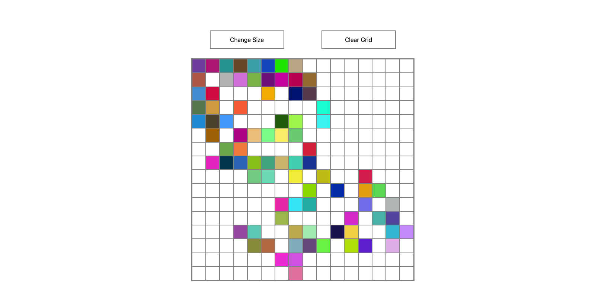

# Project: Etch-a-Sketch

A browser-based version of the classic Etch-a-Sketch toy, built as part of The Odin Project's Foundations Curriculum. This project demonstrates DOM manipulation, event listeners, and dynamic layout styling using Flexbox.

## Preview

## Features

- **Dynamic Grid Generation:** Built entirely using JavaScript DOM manipulation.
- **Pure Flexbox Layout:** Perfectly scales the squares to fit within a fixed 600px container, regardless of the grid density.
- **Rainbow Mode:** Every time the mouse hovers over a square, it receives a completely randomized RGB color.
- **Grid Resizing:** A custom button allows users to change the resolution of the grid (from 2x2 up to a safe limit of 100x100) via a popup prompt.
- **Clear Canvas:** Reset the current board back to blank with a single click without changing the resolution.

## Technologies Used

- **HTML5**
- **CSS3** (Flexbox, CSS Variables)
- **JavaScript** (ES6+, DOM Events)

## What I Learned from this Project

- **Event Listeners & Scope:** Understanding how to properly scope variables within loops so each generated `div` receives its own independent `mouseover` listener.
- **DOM Cleansing:** Safely clearing the parent container's content using `container.innerHTML = ""` before rebuilding a resized grid.
- **Mathematical Layout Scaling:** Dynamically calculating percentages (`100 / gridSize`) inside JavaScript to inject inline styles for pixel-perfect Flexbox alignment.
- **NodeList Manipulation:** Utilizing `querySelectorAll` combined with `.forEach()` to bulk-update element styles for the "Clear Grid" functionality.